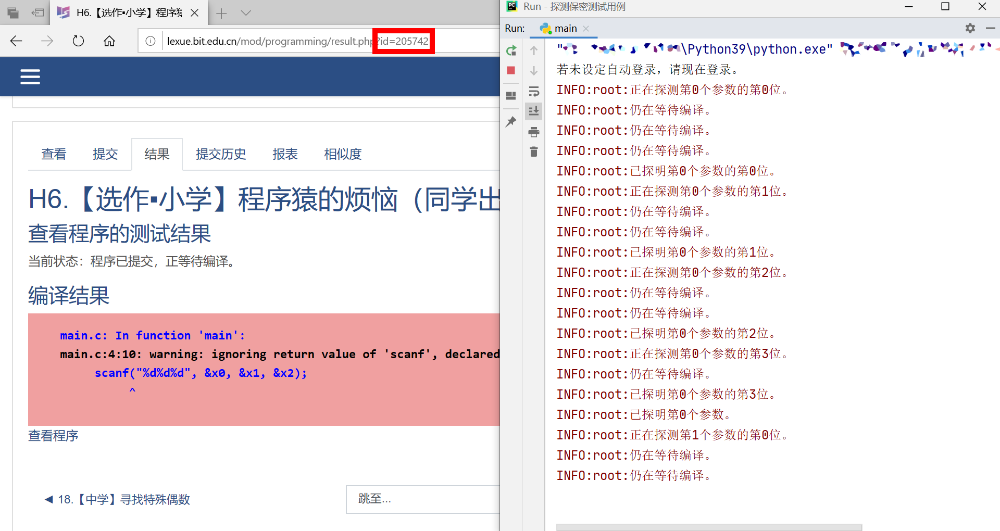

# detect-BITOJ
探测BIT乐学OJ（[lexue.bit.edu.cn/mod/programming/*](http://lexue.bit.edu.cn/mod/programming/)）的保密测试用例。

如果您的唯一目的是查看已探明的保密测试用例，请移步[保密测试用例.md](保密测试用例.md)。

[toc]

## 这合法吗？

至少我认为它是合法的。

这个程序并不会窃取教师的密码，也不会攻破OJ系统，它只是充分利用了每个人都见到过的信息——测试结果（AC/WA/TLE/……）。此外，适度使用这个程序并不会过分压迫服务器（它不会并发提交程序）。

这恐怕也不涉及作弊，因为每周上课后老师都允许同学们来看保密测试用例（且不限制题目范围），这个程序只是提早了看测试用例的时刻。（有心的同学完全可以在做题之前就复制一份保密测试用例，需要时再看，这样更早。）

## 好，那它的原理？

一个程序提交后的测试结果（广义）大概长这样：

| No.  | 权重 | 时间限制 | 内存限制 | 测试输入 | 期待的输出 | 测试输出 | 错误信息 | 用时(秒) | 内存 | 程序返回值 | 通过 |        测试结果        |
| :--: | :--: | :------: | :------: | :------: | :--------: | :------: | :------: | :------: | :--: | :--------: | :--: | :--------------------: |
|  1   |  1   |  无限制  |   64M    | 2012 7 9 |    :-)     | 无结果！ |    无    |  0.001   |  96  |    保密    |  否  | FPE: 浮点运算错误(除0) |
|  2   |  1   |   1秒    |   64M    |   abc    |    [-:     |   [-:    |    无    |  0.002   |  0   |    保密    |  是  |      AC: 完全正确      |
|  3   |  2   |   1秒    |   64M    |   保密   |    保密    |   保密   |   保密   |  0.002   |  0   |    保密    |  否  |     WA: 错误的结果     |

> $1\div0$是“一**除以**零”或“**以**零**除**一”，而非“一**除**零”，OJ写错了。

其中No. 3是保密测试用例，我们只能知道程序的用时、内存和测试结果（狭义），其中只有测试结果（狭义）是较为可控的。我们可以从测试结果获取信息，例如二分法：

```c
#include <stdio.h>
#include <stdlib.h> 

void guess(int v, int guess){
    if(v < guess){
        // TLE: 超过时间限制
        while(1);
    }
    else if(v > guess){
        //FPE: 浮点运算错误(除0)
        int tmp = 0;
        printf("%d", 1/tmp);
    }
    else if(v == guess){
        // RE: 无效内存引用
        abort();
    }
    else{
        // WA: 错误的结果 
        ;
    } 
}

int main(){
    int x;
    scanf("%d", &x);
    guess(x, 2);
}
```

> 如果`#include <signal.h>`，那么`raise()`也有类似效果，例如`raise(SIGFPE);`就真的会报FPE。类似的符号常量还有`SIGKILL`（TLE）、`SIGABRT`（RE）、`SIGBUS`（KS）等。

探测单个保密测试用例时，二分法已经足够好；但很多题目有多个保密测试用例，二分法每次只能针对一个，故效率较低。因此，我后来改为逐一获取二进制位（`v>>n & 1`），这样每次提交时所有保密测试用例的测试结果都能利用上。

> 程序很难判断自己是在那个测试用例中，故无针对性。
>
> 不过也许有办法：每个测试用例中分配给变量的地址是不同，也许可据此判断程序在哪个测试用例中。

例如某道题的输入只有一个2-bit整数，那么可依次提交下面两个代码并记录测试结果。对于任意一个测试用例，如果两次的测试结果都是TLE，那么`x`既是奇数，又能写成 $4k+2$ 或 $4k+3$ （$k\in\N$）。由 $x\in\{0,1,2,3\}$ ，可知它必为3。其它情况类似。

```python
输入 x
若 x % 2 == 1:
    raise TLE
否则:
    raise FPE
```

```python
输入 x
若 x % 4 >= 2:
    raise TLE
否则:
    raise FPE
```

对于输入多个整数的题目，逐一判断即可。

对于输入字符的题目，可用`scanf("%c", &x);`读入ASCII码，转化为整数。但这种一般只会输入`[0-9a-zA-Z]`，所以自己定义一种字符编码也许更快。

## 我怎样运行它？

您需要安装：

- python，以及第三方库selenium。

  这个程序需要通过python/selenium来控制浏览器，提交代码、读取测试结果、计算测试用例。

  python版本在3.6及以上（支持PEP 498格式化字符串字面值f-string）应该都可以。作为参考，我这里的版本是python 3.9.0、selenium 3.141.0。

- 浏览器，以及WebDriver。

  这个程序本身并不包含浏览器，所以您需要提供一个；不同的浏览器可能有不同的“话语体系”，而这个程序几乎是通用的，所以您还要提供连接程序与浏览器的桥梁——WebDriver。

  我这里用的浏览器是Microsoft Edge (Chromium)。您需要从[这里](https://developer.microsoft.com/en-us/microsoft-edge/tools/webdriver/)下载WebDriver并存到某处，然后将程序中`webdriver.Edge()`这一行的`executable_path`改为您那里 msedgedriver.exe 的位置。（如下）

  ```python
  ...
  if __name__ == "__main__":
      ...
  	browser = webdriver.Edge(executable_path=r"D:\softwares\edgedriver_win64\msedgedriver.exe")
      ...
  ```

  若使用Edge Legacy，则只需按[刚才那里](https://developer.microsoft.com/en-us/microsoft-edge/tools/webdriver/)的提示操作，不需下载。然后将程序里的`executable_path`删掉，直接写`browser = webdriver.Edge()`即可。

  其它主流浏览器应该都可以，方法类似，只是需将`webdriver.Edge()`改为`webdriver.Firefox()`之类的。具体的步骤请自行搜索。

做好准备工作后，您要将 main.py 和 generate_C_code.py 下载到同一目录，然后运行 main.py ，下面按照提示操作即可。（如果您有IDE，建议在Debug模式下运行，因为这个程序还比较脆弱。）

程序会提示输入探测目标，样例是`[("205933", 3, 12, "")]`。它的意思是探测题目#205933的测试用例，它的每个输入有3个12-bit整型，采用默认方法输入（`scanf()`的格式字符串采用若干`%d`）。其中“205933”指的是页面的id，即 URL 末尾“?id=”之后的数字。（见下图红框）



## 为何需要我的账号、密码？

如前所述，程序需要提交代码，因而需要一个已登录的账户。

WebDriver控制的浏览器窗口可能和您直接打开浏览器产生的窗口略有不同，您的cookies、浏览器插件及密码自动填充都可能失效。故可能需要重新登录。

像这样的程序确实有可能窃取您的账号、密码，您的确应当保持警惕。但若您检查一下这个程序的代码，就会发现它并未这样做。

## 运行的结果？

如果程序能一直运行到结束，结果会被直接打印出来。但无论是否如此，结果（一般）都会存入 main.py 所在目录的 arguments.txt 中。

若结束程序后想再回看人类易读的形式，可将 arguments.txt 中相应词典复制出来，在 main.py 所在目录运行python，`import main`，将复制的内容塞给`main.print_arguments()`。

> 在某一目录运行python的方法：用文件资源管理器打开目录，Alt+D，输入“cmd”，Enter。在弹出的窗口输入“python”，Enter。

## 可能存在的问题与局限性

### 测试用例输入的整数的个数是可变的，怎么办？

没办法。

我目前想到的较好的办法：将输入的个数设为一个较大的数，然后在Debug模式运行，并不时暂停程序看一下变量`arguments`。

### 我不是BITer，能用吗？

只要OJ会单独反馈每个测试用例的结果，原理就是行得通的。您可以改造一下这个程序。

### 为何只探测测试输入，不探测测试输出？

探测测试输出效率/功率很低。

对于测试输入，我们可以将测试输入分成若干小部分，逐个解决，因为判断猜测是否正确的部分是由我们控制的。而测试输出的判断由OJ控制，只提供是否“整体正确”，不提供是否“部分正确”，故只能穷举。

具体地说，若某道题有$m$个保密测试用例，每个测试用例有$n$bits（讨论输入时指输入，讨论输出时指输出），那么探测输入的时间复杂度是$\mathcal O(n)$，探测输出的则是$\mathcal O(2^n)$。两者的常数也稍有差别：前者可以有WA/TLE/FPE/RE/KS多种测试结果，而后者只有WA/AC。

> 作为参考，探测BITOJ的速率大约为每个测试用例 0.1~0.4 bit/s 。

### 我的网络不佳，总是报错

确实有这个问题。

```python
Traceback (most recent call last):
	File "…/main.py", line …, in …:
		WebDriverWait(browser, 10).until(
	File "…\site-packages\selenium\…\wait.py", in until
		raise TimeoutException(message, screen, stacktrace)
selenium.common.exceptions.TimeoutException: Message:
```

> 我才注意到两个地址的斜杠是不一样的……

原理上是有办法断点续“探”的，但目前还没支持。

目前的办法：将`WebDriverWait(browser, 10).until(…)`的“10”改为大一些的数（它代表最长等待时间），然后重新运行。

> 也可以改`detect()`：将`arguments`的初始值设为已探明的结果（仍以词典的形式），给`indices`参数传入接下来要探测的变量的索引，将`is_first_argument`的初始值设为`False`。
